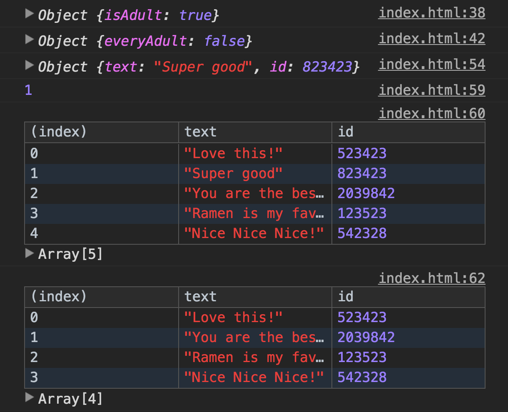

> This is a JavaScript practice with [JavaScript30](https://javascript30.com/) by [Wes Bos](https://github.com/wesbos) without any frameworks, no compilers, no boilerplate, and no libraries.

# 07 - Array Cardio Day 2


view demo [here](https://sujon-ahmed.github.io/JS30/07-Array%20cardio%20day%202/index.html)

`Array.prototype.some()`, `Array.prototype.every()`, `Array.prototype.find()`, `Array.prototype.findIndex()`, `Array.prototype.splice()`, `Array.prototype.slice()`

### `Array.prototype.some()`

The [`some()`](https://developer.mozilla.org/en-US/docs/Web/JavaScript/Reference/Global_Objects/Array/some) method tests whether some element in the array passes the test implemented by the provided function. which means that it checks at least one thing in the array matches something. just like `OR` operation.

```
const isAdult = people.some(function(person) {
  const currentYear = (new Date()).getFullYear();
  if (currentYear - person.year >= 19) {
    return true;
  }
});
```

rewrite above in ES6 syntax:

```
const isAdult = people.some(person => (new Date()).getFullYear() - person.year >= 19);
```

- **[NOTICE]**: `getFullYear()` is a **function** of Date, not a property.

`some()` example:

```
function isBiggerThan10(e) {
  return e > 10;
}

console.log([2, 5, 8, 1, 4].some(isBiggerThan10));  // false
console.log([12, 5, 8, 1, 4].some(isBiggerThan10)); // true
```

### `Array.prototype.every()`

The [`every()`](https://developer.mozilla.org/en-US/docs/Web/JavaScript/Reference/Global_Objects/Array/every) method tests whether all elements in the array pass the test implemented by the provided function. like `AND` operation.

```
const everyAdult = people.every(person => (new Date()).getFullYear() - person.year >= 19);
```

`every()` example:

```
function isBigEnough(e) {
  return e >= 10;
}

console.log([12, 5, 8, 130, 44].every(isBigEnough));   // false
console.log([12, 54, 18, 130, 44].every(isBigEnough)); // true
```

### `console.log(allAdult)` VS. `console.log({allAdult})`

```
console.log(allAdult)    // gives the value of allAdult variable
console.log({allAdult})  // gives the allAdult object itself
```


### `Array.prototype.find()`

The [`find()`](https://developer.mozilla.org/en-US/docs/Web/JavaScript/Reference/Global_Objects/Array/find) method returns a value of the **first** element in the array that satisfies the provided testing function. Otherwise `undefined` is returned.

`find()` is like filter but instead of returning a subset of the array it returns the first item it finds (or `undefined`).

```
const comment = comments.find(comment => comment.id == 823423);
```

`find()` example:

```
function isBigEnough(e) {
  return e >= 15;
}

[12, 5, 8, 130, 44].find(isBigEnough);  // 130
```

### `Array.prototype.findIndex()`

The [`findIndex()`](https://developer.mozilla.org/en-US/docs/Web/JavaScript/Reference/Global_Objects/Array/findIndex) method returns an **index** of the first element in the array that satisfies the provided testing function. Otherwise `-1` is returned.

```
const index = comments.findIndex(comment => comment.id == 823423);
```

`findIndex()` example:

```
function isBigEnough(e) {
  return e >= 15;
};
[12, 5, 8, 130, 44].findIndex(isBigEnough);  // 3 (the value 130's index of the array is 3)
```

- `find()` and `findIndex()` are the new features of ES6

### `Array.prototype.splice()`

The [`splice()`](https://developer.mozilla.org/en-US/docs/Web/JavaScript/Reference/Global_Objects/Array/splice) method changes the content of an array by removing existing elements and/or adding new elements.

```
comments.splice(index, 1); // will change content of the origin array
```

`splice()` syntax:

```
array.splice(start)
array.splice(start, deleteCount)
array.splice(start, deleteCount, item1, item2, ...)
```

- `start`: index at which to start changing the array (with origin 0)
  - if greater than the length of the array, actual starting index will be set to the length of the array.
  - if negative, will begin that many elements from the end of the array.
- `deleteCount`: an integer indicating the number of old array elements to remove.
  - if deleteCount is 0, no elements are removed. in this case, you should specify at least one new element.
  - if deleteCount is omitted, deleteCount will be equal to (arr.length - start)
- `item1, item2, ...`: the elements to add to the array, beginning at the start index. If you don't specify any elements, splice() will only remove elements from the array.

now let's try it

- `slice()` starts from `index = 2`, `deleteCount = 0` and add new element `15`

```
var nums = [0, 1, 2, 3, 4, 5];
nums.splice(2,0,15);
console.log(nums);   // [0, 1, 15, 2, 3, 4, 5]
```

- `slice()` starts from `index = 2`, `deleteCount = 2` and add new element `15`

```
var nums = [0, 1, 2, 3, 4, 5];
nums.splice(2,2,15);
console.log(nums);   // [0, 1, 15, 4, 5]
```

### `Array.prototype.slice()`

The [`slice()`](https://developer.mozilla.org/en-US/docs/Web/JavaScript/Reference/Global_Objects/Array/slice) method returns shallow copy of a protion of an array into a new array object selected from begin to end (**end NOT included**). The original array will not be modified.

```
const newComments = [
  ...comments.slice(0, index),
  ...comments.slice(index + 1)
];
```
in above `...` is the ES6 [spread syntax](https://developer.mozilla.org/en-US/docs/Web/JavaScript/Reference/Operators/Spread_operator)

let's take a look those two `...comments.slice()` above, what do we get for our `newComments` array:

- now we know that the `index = 1` which is the element we want to delete.


`slice()` syntax:

```
arr.slice()
arr.slice(begin)
arr.slice(begin, end)
```

- `begin` (optional): zero-based index at which to begin extraction.
  - as a negative index, begin indicates an offset from the end of the sequence.
    - `slice(-2)` extracts the last two elements in the sequence.
  - if begin is undefined, slice begins from index 0.
- `end` (optional): zero-based index at which to end extraction. slice extracts up to but **NOT including end**.
  - `slice(1,4)` extracts the second element through the fourth element (elements indexed 1, 2, and 3).
  - as a negative index, end indicates an offset from the end of the sequence.
    - `slice(2,-1)` extracts the third element through the second-to-last element in the sequence.
  - if end is omitted, slice extracts through the end of the sequence (arr.length).
- returns a new array containing the extracted elements.

now let's try it

```
var nums = [0, 1, 2, 3, 4, 5];
var newNums = nums.slice(2,4);
console.log(nums);     // [0, 1, 2, 3, 4, 5]
console.log(newNums);  // [2, 3]
```

results in our tutorial:



